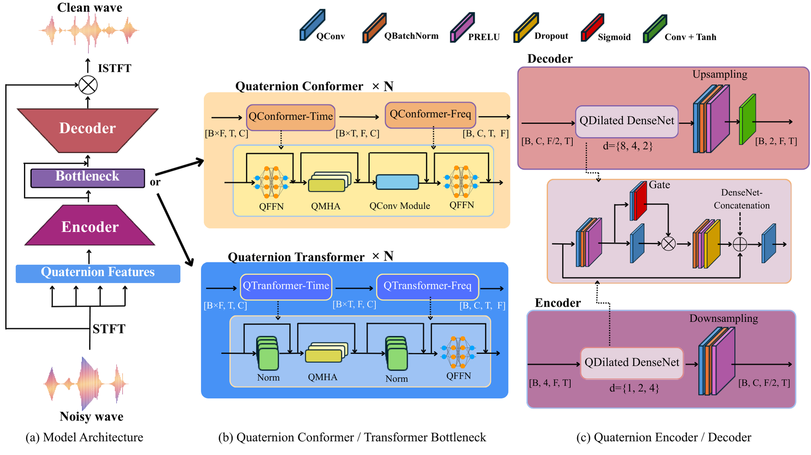

# Quaternion Self-Attention with Shared Scores

Official PyTorch implementation of
**"Quaternion Self-Attention with Shared Scores"**
(ICML 2026).
Shogo Yamauchi, Tohru Nitta, Hideaki Tamori.

> TL;DR — We replace the four component-wise softmaxes of Hamilton-product
> quaternion attention (Tay et al., 2019) with a **single real-valued score
> `S = Re(Q ⊗ K†) / √(4dₕ)`** that is **shared across all four quaternion
> components of V**. This reduces the per-pair score multiplications from
> 16 → 4 and the number of softmaxes from 4 → 1, lowering inference RTF by
> up to **44.3% on GPU / 58.1% on CPU** on speech enhancement while
> preserving quality.

<p align="center">
  
</p>

---

## Highlights

- **Shared-score quaternion self-attention.** Score matrix is the real
  part of the quaternion inner product, `S = Re(Q ⊗ K†) / √(4dₕ)`; a
  single softmax produces one attention map shared by all of
  `V₀, V₁, V₂, V₃`. We prove this is an exact Euclidean dot product in
  ℝ^{4dₕ} and analyze why component-wise independence is structurally
  redundant once Q/K are produced by quaternion linear projections
  (paper §3, §5, App. C.1).
- **TS-Conformer bottleneck in quaternion space.** Time-axis and
  frequency-axis Conformer blocks (`QFFN ½ → QMHA → QConv → QFFN ½`) with
  shared-score attention; 2 layers × {time, freq} × 4 heads in our
  experiments.
- **Quaternion Dilated DenseNet encoder / decoder.** Gated quaternion
  convolutions with dilations `[1, 2, 4, 8]` (encoder) / `[8, 4, 2, 1]`
  (decoder), plus sub-pixel upsampling.
- **cIRM output head.** `Conv2d → Tanh` predicting a complex Ideal Ratio
  Mask in `[-1, 1]`, applied to the noisy STFT before ISTFT.
- **VoiceBank+DEMAND & DNS-Challenge 3** (16 kHz). Composite loss:
  multi-resolution STFT + SI-SDR + RMS + complex-L1 + PESQ.

---

## Repository structure

```
.
├── assets/                 # Figures used in the paper / README
├── configs/
│   └── train_comformer.yaml
├── core_qnn/               # Quaternion primitives
│   ├── quaternion_attention.py    # Shared-score QMHA, QRMSNorm
│   ├── quaternion_layers.py       # QConv, QLinear, QBatchNorm, ...
│   └── quaternion_ops.py          # Hamilton product, r/i/j/k accessors
├── models/
│   ├── conformer.py        # QuaternionConformer (Time → Freq) blocks
│   ├── generator.py        # Encoder / Bottleneck / Decoder / mask head
│   └── loss.py             # MR-STFT, SI-SDR, RMS, complex-L1, PESQ
├── checkpoints/            # Pretrained weights (best_model.pt)
├── dataloader.py
├── train.py
├── inference.py
├── metrics.py
├── utils.py
└── requirements.txt
```

---

## Installation

```bash
git clone https://github.com/<your-org>/Quaternion-Self-Attention-with-Shared-Score.git
cd Quaternion-Self-Attention-with-Shared-Score

conda create -n qsasa python=3.10 -y
conda activate qsasa

pip install -r requirements.txt
```

Tested with PyTorch 2.6.0 / CUDA 12.x on Linux. The PESQ loss requires a
working build of [`pesq`](https://pypi.org/project/pesq/) and
[`torch_pesq`](https://pypi.org/project/torch_pesq/).

---

## Dataset

We use the **VoiceBank + DEMAND** corpus resampled to 16 kHz. After
downloading, arrange the files as:

```
dataset/voicebank-demand-16k/
├── clean_trainset_28spk_wav/
├── noisy_trainset_28spk_wav/
├── clean_testset_wav/
└── noisy_testset_wav/
```

and update the paths in `configs/train_comformer.yaml` (`data.train.*`,
`data.test.*`) if you place the data elsewhere.

---

## Training

Single-GPU:

```bash
python train.py --config configs/train_comformer.yaml --gpus 0
```

Multi-GPU (DDP) — pass a comma-separated GPU list:

```bash
python train.py --config configs/train_comformer.yaml --gpus 0,1,2,3
```

Useful overrides (all optional, fall back to YAML):

```bash
--batch-size 8          # training batch size
--epochs 400            # number of epochs
--workers 4             # dataloader workers
--output-dir ./checkpoints/quaternion_comformer
--resume <ckpt.pt>      # resume from checkpoint
```

TensorBoard logs (loss curves, audio samples, spectrograms) are written to
`./logs` by default.

### Default training recipe

| | value |
|---|---|
| Sample rate / segment | 16 kHz / 1 s |
| STFT | n_fft=400, hop=100, Hann |
| Optimizer | Adam (β=0.5, 0.999) |
| LR / scheduler | 2e-4 → cosine, warmup 10 ep, min 1e-4 |
| Batch size | 8 |
| Epochs | 400 |
| Loss weights | MR-STFT 3.5 / SI-SDR 2.0 / RMS 1.0 / cL1 2.5 / PESQ 1.0 |

See `configs/train_comformer.yaml` for the full configuration.

---

## Inference

Run enhancement on the VoiceBank+DEMAND test set with the released
checkpoint:

```bash
python inference.py \
  --checkpoint checkpoints/best_model.pt \
  --config     checkpoints/config.yaml \
  --test_dir   ./dataset/voicebank-demand-16k/noisy_testset_wav \
  --output_dir ./inference_results
```

Single file:

```bash
python inference.py \
  --checkpoint checkpoints/best_model.pt \
  --config     checkpoints/config.yaml \
  --wav_file   path/to/noisy.wav \
  --output_dir ./inference_results
```

Metrics (PESQ / STOI / SI-SDR / CSIG / CBAK / COVL) are written to
`inference_results/` alongside the enhanced WAVs.

---

## Results

### VoiceBank+DEMAND (Table 2 in the paper)

| Method | Attention | Params (M) | PESQ | CSIG | CBAK | COVL | STOI | SI-SDR |
|---|---|---:|---:|---:|---:|---:|---:|---:|
| Noisy | – | – | 1.97 | 3.35 | 2.44 | 2.63 | 0.91 | – |
| Real-valued Conformer | Standard | 3.19 | 3.25 | 4.43 | 3.68 | 3.88 | 0.95 | 19.09 |
| QDenseNet (no bottleneck) | – | 0.74 | 2.80 | 3.84 | 3.41 | 3.32 | 0.94 | 18.42 |
| QTN (Yang et al., 2023) | QConv-based | 0.63 | 2.76 | 3.76 | 3.43 | 3.26 | 0.94 | 19.55 |
| QTransformer (Tay et al., 2019) | Hamilton | 0.62 | 3.07 | 4.23 | 3.61 | 3.68 | 0.95 | 19.62 |
| **QTransformer (Ours)** | **Shared Score** | **0.62** | **3.07** | **4.30** | **3.62** | **3.71** | **0.95** | **19.69** |
| QConformer (Tay et al., 2019) | Hamilton | 0.80 | 3.11 | 4.30 | 3.73 | 3.78 | 0.95 | 19.62 |
| **QConformer (Ours)** | **Shared Score** | **0.80** | **3.18** | **4.36** | **3.65** | **3.79** | **0.95** | **19.36** |

Bold = best among quaternion models. Our QConformer matches the
real-valued Conformer (PESQ 3.18 vs 3.25) with only **25%** of the
parameters.

### DNS-Challenge 3 — quality + efficiency (Table 3)

| Method | Attention | Params (M) | OVRL | SIG | BAK | P.808 | GPU RTF | CPU RTF |
|---|---|---:|---:|---:|---:|---:|---:|---:|
| Real-valued Conformer | Standard | 3.19 | 2.77 | 3.12 | 3.77 | 3.41 | 0.0071 | – |
| QTransformer (Tay et al., 2019) | Hamilton | 0.62 | 2.61 | 3.07 | 3.44 | 3.30 | 0.0192 | 0.594 |
| **QTransformer (Ours)** | **Shared Score** | 0.62 | 2.67 | 3.06 | **3.61** | 3.36 | **0.0107** | **0.249** |
| QConformer (Tay et al., 2019) | Hamilton | 0.80 | 2.67 | 3.08 | 3.57 | 3.33 | 0.0202 | 0.610 |
| **QConformer (Ours)** | **Shared Score** | 0.80 | 2.69 | 3.11 | **3.57** | 3.32 | **0.0157** | **0.259** |

GPU RTF measured on NVIDIA A100 80 GB; CPU RTF on Intel Xeon Gold 6342
(448 utterances, 6.86 s each). The shared-score formulation reduces RTF
by **22.3 – 44.3 % on GPU** and **57.5 – 58.1 % on CPU** vs. the
Hamilton-product baseline at matched parameter count.

### Pretrained checkpoint

`checkpoints/best_model.pt` corresponds to the **QConformer (Ours)** row
in Table 2 (0.80 M params, PESQ 3.18). The matching config is
`checkpoints/config.yaml`.

---

## Method overview

The generator follows an **Encoder – Bottleneck – Decoder** layout
(see `assets/model.png`):

1. **Quaternion features.** STFT magnitude/real/imag are packed as a
   pure-quaternion tensor `[B, 4, T, F]`.
2. **Encoder (`QuaternionDilatedEncoder`).** Four gated quaternion
   DenseNet blocks with dilations `[1, 2, 4, 8]` along time, followed by
   frequency downsampling.
3. **Bottleneck (`QuaternionConformer`).** `n_layers` Conformer blocks
   along the time axis, then `n_layers` along the frequency axis. Each
   block uses `QFFN ½ → QMHA → QConv → QFFN ½` with post-LayerNorm.
4. **Shared-score QMHA (`QuaternionMultiHeadAttention`).**
   `score = Re(Q · K*ᵀ) / √d`, a single softmax, then the same attention
   matrix is applied to every quaternion component of V.
5. **Decoder (`QuaternionDilatedDecoder`).** Mirror of the encoder with
   dilations `[8, 4, 2, 1]` and transposed-conv frequency upsampling. An
   encoder→decoder skip is fused via a 1×1 quaternion conv
   (`bottleneck_skip_fusion`).
6. **Mask head.** Quaternion conv → real Conv2d (2 channels) → `Conv2d +
   Tanh` to produce a cIRM in `[-1, 1]`, applied to the noisy STFT before
   ISTFT.

---

## Citation

```bibtex
@inproceedings{yamauchi2026qsasa,
  title     = {Quaternion Self-Attention with Shared Scores},
  author    = {Yamauchi, Shogo and Nitta, Tohru and Tamori, Hideaki},
  booktitle = {Proceedings of the 43rd International Conference on Machine Learning (ICML)},
  series    = {PMLR 306},
  year      = {2026},
  address   = {Seoul, South Korea}
}
```

---

## Acknowledgements

- Quaternion layer primitives in `core_qnn/` build on the quaternion
  neural network literature (Parcollet et al.).
- The TS-Conformer bottleneck design is inspired by CMGAN.
- Trained and evaluated on VoiceBank + DEMAND.

---

## License

Licensed under the [Apache License, Version 2.0](LICENSE).
